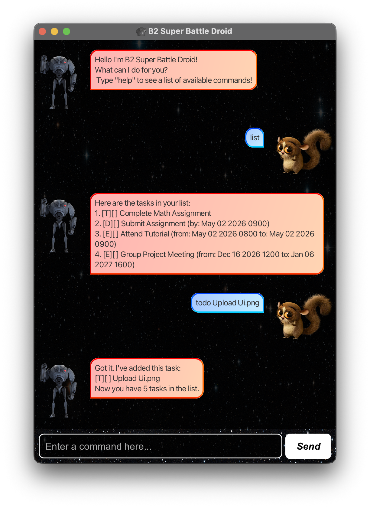

# B2 Super Battle Droid User Guide



## Introduction

I have managed to capture and convert a B2 Super Battle Droid from a menacing, relentless killing machine into a docile, helpful task-managing assistant (Although he may exhibit some aggressive tendencies if you annoy him with invalid commands). This guide will walk you through the features and functionalities of the B2 Super Battle Droid chatbot!

## Features
- **Listing tasks**: View all your current tasks in a clear and organized manner.
- **Adding tasks**: Add Todos, Deadlines, and Events with specific details.
- **Editing tasks**: Modify details of existing tasks, such as changing the description or updating the deadline.
- **Deleting tasks**: Remove tasks from the list when they are no longer needed.
- **Marking/Unmarking tasks as completed**: Mark tasks as done or revert them back to pending status.
- **Finding tasks by keyword**: Search for tasks containing specific keywords in their descriptions.
- **Data persistence**: All tasks are saved to `data/tasks.txt`, ensuring that your data is not lost when you exit the application. When you start the application again, it will load your existing tasks from the `tasks.txt` file.
- **Help menu**: Access a comprehensive list of commands and their formats to easily navigate the chatbot's functionalities.

## Help menu

Access the help menu to view a list of available commands and their respective formats.

**Command Format**: `help`

**Expected Outcome**:
```
Here are the available commands:
1. list: List all tasks
2. mark <task index>: Mark a task as done
3. unmark <task index>: Mark a task as not done
4. delete <task index>: Delete a task
5. todo <description>: Add a Todo task
6. deadline <description> /by <deadline>: Add a Deadline task
7. event <description> /from <start time> /to <end time>: Add an Event task
8. find <keyword>: Find tasks containing the keyword
9. help: Show this list of commands
10. bye: Exit the application
11. edit <task index> <field: description/by/from/to> <new value>: Edit a task's description or dateTime where applicable

Accepted date and time formats: dd/MM/yyyy HHmm or dd-MM-yyyy HHmm
```

## Adding tasks

### Adding Todos

Add a basic task with a description.

**Command Format**: `todo <description>`

**Example**: `todo math homework`

**Expected Outcome**:

```
Got it. I've added this task:
[T][ ] math homework
Now you have 1 task in the list.
```

### Adding Deadlines

Add a task with a description and a deadline.

**Command Format**: `deadline <description> /by <deadline>` where `<deadline>` is in the format `dd-MM-yyyy HHmm` or `dd/MM/yyyy HHmm`.

**Example**: `deadline submit report /by 20-02-2026 2359`

**Expected Outcome**:
```
Got it. I've added this task:
[D][ ] submit report (by: Feb 20 2026 2359)
Now you have 2 tasks in the list.
```

### Adding Events

Add a task with a description, a start time, and an end time.

**Command Format**: `event <description> /from <start time> /to <end time>` where `<start time>` and `<end time>` are in the format `dd-MM-yyyy HHmm` or `dd/MM/yyyy HHmm`.

**Example**: `event team meeting /from 15-03-2026 1400 /to 15-03-2026 1500`

**Expected Outcome**:
```
Got it. I've added this task:
[E][ ] team meeting (from: Mar 15 2026 1400 to: Mar 15 2026 1500)
Now you have 3 tasks in the list.
```

## Listing tasks

List all tasks in the current task list.

**Command Format**: `list`

**Expected Outcome**:
```
Here are the tasks in your list:
1.[T][ ] math homework
2.[D][ ] submit report (by: Feb 20 2026 2359)
3.[E][ ] team meeting (from: Mar 15 2026 1400 to: Mar 15 2026 1500)
``` 

## Marking/Unmarking tasks

### Marking tasks

Mark a task as completed.

**Command Format**: `mark <task index>`

**Example**: `mark 1`

**Expected Outcome**:
```
Nice! I've marked this task as done:
[T][X] math homework
```

### Unmarking tasks

Unmark a completed task, reverting it back to pending status.

**Command Format**: `unmark <task index>`

**Example**: `unmark 1`

**Expected Outcome**:
```
OK, I've marked this task as not done yet:
[T][ ] math homework
```

## Deleting tasks

Delete a task from the list.

**Command Format**: `delete <task index>`

**Example**: `delete 2`

**Expected Outcome**:
```
Noted. I've removed this task:
[D][ ] submit report (by: Feb 20 2026 2359)
Now you have 2 tasks in the list.
```

## Finding tasks

Find tasks that contain a specific keyword in their descriptions.

**Command Format**: `find <keyword>`

**Example**: `find meeting`

**Expected Outcome**:
```
Here are the matching tasks in your list:
1.[E][ ] team meeting (from: Mar 15 2026 1400 to: Mar 15 2026 1500)
``` 

## Editing tasks

### Editing task description

Edit the description of an existing task.

**Command Format**: `edit <task index> description <new description>`

**Example**: `edit 1 description complete math homework`

**Expected Outcome**:
```
Noted. I've edited this task:
[T][ ] complete math homework
```

### Editing task deadline

Edit the deadline of an existing **Deadline** task.

**Command Format**: `edit <task index> by <new deadline>` where `<new deadline>` is in the format `dd-MM-yyyy HHmm` or `dd/MM/yyyy HHmm`.

**Example**: `edit 2 by 25-02-2026 2359`

**Expected Outcome**:
```
Noted. I've edited this task:
[D][ ] submit report (by: Feb 25 2026 2359)
```

### Editing task start time

Edit the start time of an existing **Event** task.

**Command Format**: `edit <task index> from <new start time>` where `<new start time>` is in the format `dd-MM-yyyy HHmm` or `dd/MM/yyyy HHmm`.

**Example**: `edit 3 from 15-03-2026 1300`

**Expected Outcome**:
```
Noted. I've edited this task:
[E][ ] team meeting (from: Mar 15 2026 1300 to: Mar 15 2026 1500)
```

### Editing task end time

Edit the end time of an existing **Event** task.

**Command Format**: `edit <task index> to <new end time>` where `<new end time>` is in the format `dd-MM-yyyy HHmm` or `dd/MM/yyyy HHmm`.

**Example**: `edit 3 to 15-03-2026 1600`

**Expected Outcome**:
```
Noted. I've edited this task:
[E][ ] team meeting (from: Mar 15 2026 1300 to: Mar 15 2026 1600)
```

## Exiting the program

Exit the program.

**Command Format**: `bye`

**Expected Outcome**:
```
Bye. Hope to see you again soon!
```

## Command Summary

| Command                 | Format                                                  | Example                                                        |
|-------------------------|---------------------------------------------------------|----------------------------------------------------------------|
| List tasks              | `list`                                                  |                                                                |
| Mark task as done       | `mark <task index>`                                     | `mark 1`                                                       |
| Unmark task as not done | `unmark <task index>`                                   | `unmark 1`                                                     |
| Delete task             | `delete <task index>`                                   | `delete 2`                                                     |
| Add Todo                | `todo <description>`                                    | `todo math homework`                                           |
| Add Deadline            | `deadline <description> /by <deadline>`                 | `deadline submit report /by 20-02-2026 2359`                   |
| Add Event               | `event <description> /from <start time> /to <end time>` | `event team meeting /from 15-03-2026 1400 /to 15-03-2026 1500` |
| Find tasks by keyword   | `find <keyword>`                                        | `find meeting`                                                 |
| Edit task description   | `edit <task index> description <new description>`       | `edit 1 description complete math homework`                    |
| Edit task deadline      | `edit <task index> by <new deadline>`                   | `edit 2 by 25-02-2026 2359`                                    |
| Edit task start time    | `edit <task index> from <new start time>`               | `edit 3 from 15-03-2026 1300`                                  |
| Edit task end time      | `edit <task index> to <new end time>`                   | `edit 3 to 15-03-2026 1600`                                    |
| Help menu               | `help`                                                  |                                                                |
| Exit program            | `bye`                                                   |                                                                |